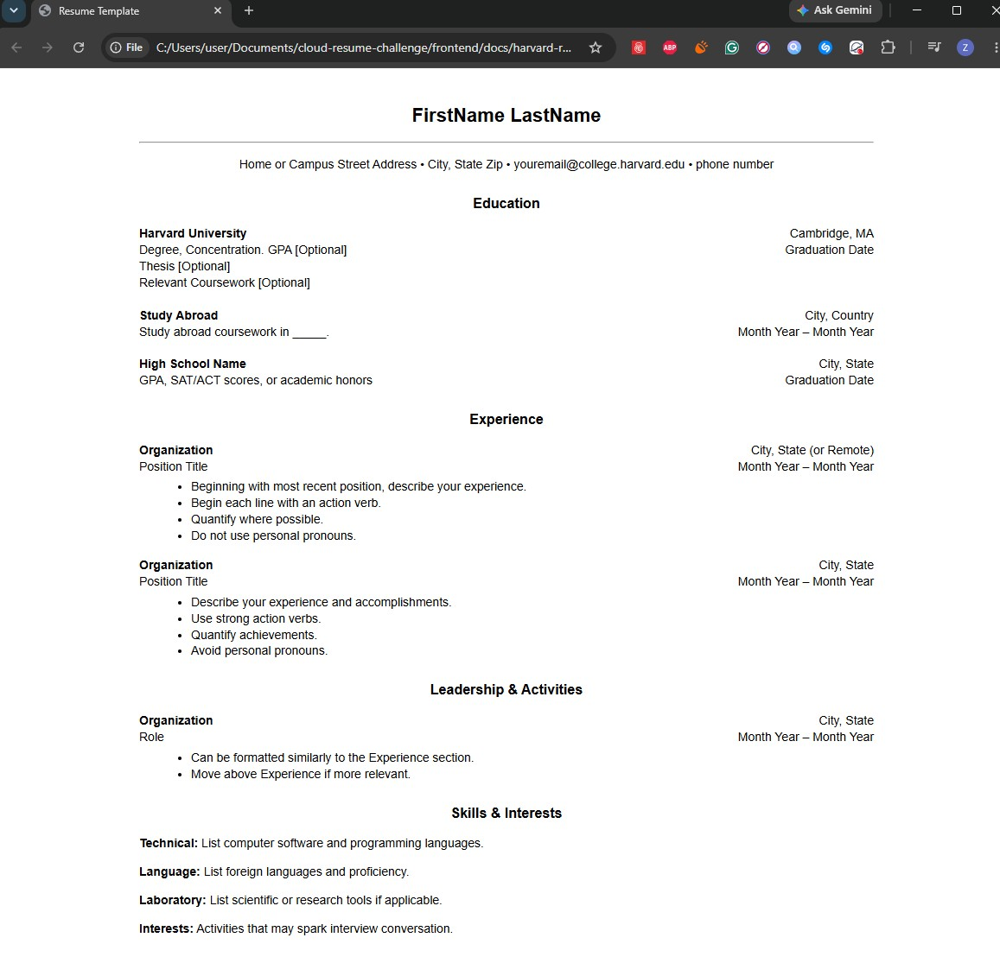

# Frontend Technical Specification

This directory contains the files used to render the website.

The frontend is the user-facing portion of my Cloud Resume Challenge. It started as a simple static HTML/CSS resume and evolved into a React application with multiple pages, reusable components, responsive styling, project pages, and an AWS-backed visitor counter.

## Resume Format Considerations

I live in the United States and resumes in word/pdf format typically exclude information that can be discrimitive. 

I'm going to use the [Harvard Resume Template format](https://careerservices.fas.harvard.edu/resources/bullet-point-resume-template/) as the template for my resume.

### Harvard Resume Template
I know HTML and CSS, so I used GenAI to generate out a HTML and CSS template and afterwords I will refactor the code. 

Prompt to ChatGPT: 

```text
Convert this resume template into html.
Please don't use a css framework.
Please use the least amount of css tags.
```

Image provided to LLM:


This is the [generated output](./docs/harvard-resume-format.html) that I will tweak.

This is what the unaltered generated HTML looks like:



## HTML Adjustments

- UTF8 supports most languages. I plan to use English and potentially Japanese and German in the future, so I will leave this meta tag in.
- I want the website to apply mobile styling, so I'll keep the viewport meta tag width=device-width so mobile styling scales normallly.
- I plan to extract the CSS styles into it's own stylesheet after I am satisfied with the HTML markup.
- For the HTML page, I'll use hard tabs eight spaces because I mostly code in Java and C++ and that is the standard that I am accustomed to.

## Serve Static Website Locally Through GitHub CodeSpace

I needed to serve the static website locally to use stylesheets externally from the HTML page in a Cloud Developer Environment (CDE).

> This is unnecessary in a local development environment.

### Install HTTP Server
```sh
npm i http-server -g
```

## Image Size Considerations

I am using an image for the background of the website.
It's original size was 785KB, but it can be optimized into a webp.
Throughout the project, I added many other images and kept the file sizes small.

## Frontend Framework Consideration

- I used React because it is the most popular Javascript framework.
- I chose to use vite.js because that was what the bootcamp was using.

## Website Structure

The website is organized into several pages:
* Home
* Resume
* Projects
* Individual Project Pages
* About Me

## Homepage Styling Consideration

- I was experimenting with new backgrounds as I didn't like the same background for each page and ran across glass panelling in css.
- I found it here: https://css.glass/ and then decided it would look better with my new homepage background compared to the white.
- I have adjusted many times to improve readability while maintaining a sleek modern-look version that I originally had in mind. 

## About Me Styling Consideration

I wanted the About Me page to have a more personal feeling than the resume page and this page alongside the home page gave me the freedom to experiement with visual design.

## Production Build
```sh
npm run build
```